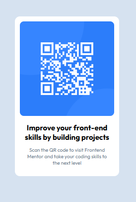

# QR Code Component – HTML & CSS Practice

This project is a solution to a challenge from **Frontend Mentor**.
The goal was to recreate a QR code component using only HTML and CSS, focusing on layout, spacing, and responsive design.

---

## 📸 Preview



---

## 🔗 Live Demo

You can view the project here:

[View Project](https://haco31.github.io/Qr-Design/)

---

## 🚀 Technologies Used

* HTML5
* CSS3
* Google Fonts

---

## 🎯 What I Practiced

* Semantic HTML structure
* CSS layout and spacing
* Working with the CSS Box Model
* Centering elements using CSS
* Responsive design basics

---

## 📂 Project Structure

```
qr-code-component/
│
├── index.html
├── style.css
└── images/
```

---

## 💡 What I Learned

While building this project I improved my understanding of:

* Structuring a simple web layout
* Managing spacing with `margin` and `padding`
* Using `border-radius` and shadows for UI components
* Creating visually centered layouts

---

## 📚 Challenge Source

This challenge was provided by **Frontend Mentor**, a platform that helps developers improve their coding skills by building realistic projects.

https://www.frontendmentor.io

---

# Componente QR – Práctica con HTML y CSS

Este proyecto es una solución a un reto de **Frontend Mentor**.
El objetivo fue recrear un componente de código QR utilizando únicamente HTML y CSS, enfocándome en la maquetación, espaciado y diseño visual.

---

## 🚀 Tecnologías utilizadas

* HTML5
* CSS3

---

## 🎯 Qué practiqué

* Estructura semántica en HTML
* Espaciado con CSS (`margin` y `padding`)
* Uso del modelo de caja (Box Model)
* Centrado de elementos en la página
* Diseño visual de componentes

---

## 💡 Qué aprendí

Durante este proyecto reforcé mi comprensión sobre:

* Cómo estructurar un layout simple
* Cómo manejar el espaciado en CSS
* Cómo estilizar componentes visuales
* Cómo organizar archivos en un proyecto web

---

## 👨‍💻 Autor

Harol Contreras
Aspiring Full-Stack Developer

---

⭐ Thanks for checking out this project!
